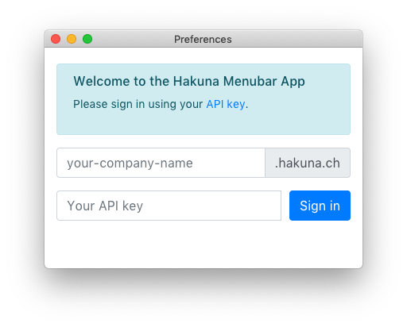
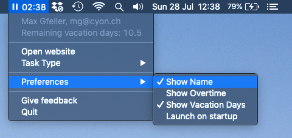

# Hakuna Menubar for macOS

Simple menubar app for macOS to track work time using [Hakuna](https://www.hakuna.ch).


Download the latest version of the application
[here](https://www.github.com/cyon/hakuna-menubar/releases).

The app itself **does not** support auto updating! So make sure to check for new releases
yourself.

## Installing and starting

Drag the `Hakuna Menubar.app` into your *Applications* folder. When you start the application
for the first time it will ask you for some permissions. Those are needed for the app to run.

The application also needs your **Hakuna API key** to run. It will prompt you the first time
you run it to enter it.



After that the application only shows up in your menubar. There are a few settings, like
enabling auto-launch, which can be set from there.



## Developing

To make changes to the application you just have to clone the repository and run the following
commands.

```
npm install
npm start
```
